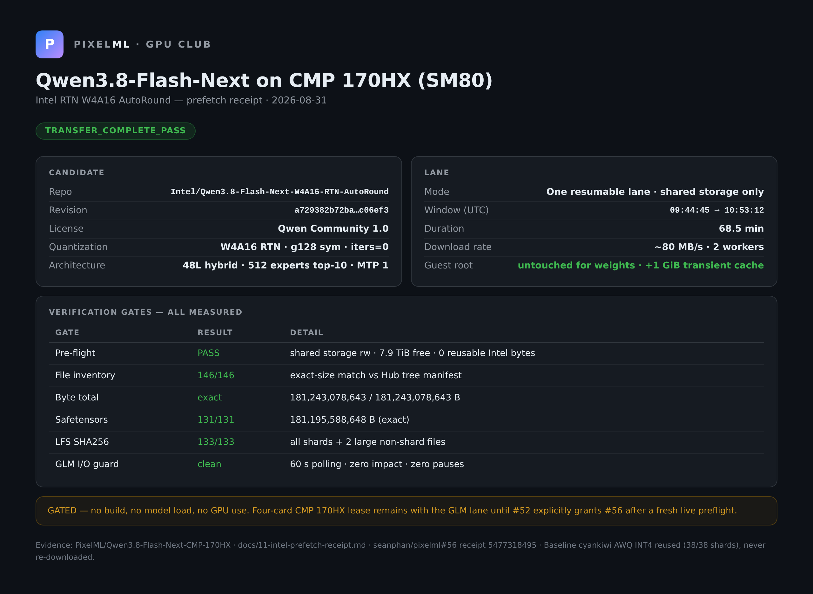

# Qwen3.8-Flash-Next on CMP 170HX (SM80)

Static-fit math, runtime compatibility, and evaluation harness for the
**Qwen3.8-Flash-Next-AWQ-INT4** checkpoint and future variants of the
Qwen3.8-Flash-Next family on four CMP 170HX cards (SM80, 64 GiB each).

## Status: CHECKPOINT_VERIFIED

**TL;DR (updated as the comparison progresses):** Two candidates are pinned for
the four-CMP A/B — the current AWQ INT4 baseline (cyankiwi @ `d39638a0`,
verified on shared storage, 38/38 shards hash-checked) and Intel's RTN W4A16
AutoRound (`Intel/Qwen3.8-Flash-Next-W4A16-RTN-AutoRound` @ `a729382b`,
prefetched to shared storage and verified: 146/146 files exact, 133/133 LFS
SHA256 OK; see `docs/10-intel-rtn-w4a16.md` and
`docs/11-intel-prefetch-receipt.md`). No throughput/quality
numbers exist yet: the run is gated on #52 granting the four-card lane after
a fresh live preflight. When measured, this section becomes the single
source of truth: best recipe, prefill/decode/aggregate tok/s,
quality/reliability verdict, topology, and the exact launch command.

Research-prep state. The storage gate was released on 2026-08-31
([seanphan/pixelml#56 comment](https://github.com/seanphan/pixelml/issues/56#issuecomment-5473633322));
the pinned checkpoint was transferred by **one resumable lane** to
`/library/models/qwen38/Qwen3.8-Flash-Next-AWQ-INT4` and verified: 50/50
files present at exact expected sizes, 38/38 safetensors shards matching
their LFS SHA256, safetensors byte total exactly 188,286,106,928. The lane
was released after verification (receipt on the tracking issue).
Nothing has been built, no weights have been loaded, and no GPU has been used.

Two gates must still clear before any resource-consuming work:

1. **Upstream gate** — the required vLLM support
   ([vllm-project/vllm#53899](https://github.com/vllm-project/vllm/pull/53899))
   must reach the decision gate defined in `docs/02-runtime-compatibility.md`
   (last measured 2026-08-31: OPEN, `mergeable_state: dirty`).
2. **Resource gate** — an exclusive four-CMP lease from
   [seanphan/pixelml#52](https://github.com/seanphan/pixelml/issues/52),
   requested only after [seanphan/pixelml#57](https://github.com/seanphan/pixelml/issues/57)
   is resolved and the upstream decision gate is met.

Tracking issue: <https://github.com/seanphan/pixelml/issues/56>

## Scope: one baseline round

The owner has narrowed `seanphan/pixelml#56` to **ONE** Qwen3.8-Flash-Next
AWQ INT4 baseline round (or a reproducible negative verdict), per
[the owner's narrowing comment](https://github.com/seanphan/pixelml/issues/56#issuecomment-5468770817)
and the master policy comment
[seanphan/pixelml#52#issuecomment-5468770811](https://github.com/seanphan/pixelml/issues/52#issuecomment-5468770811).

- `eval/configs/matrix.yaml` keeps exactly two ACTIVE cells for this round:
  the primary baseline cell and its safe fallback (part of the same single
  round). All other former cells are parked in `parked_candidates` and must
  not be scheduled until all four baseline rounds publish.
- **A classified negative verdict (startup, compatibility, capacity, or
  safety failure) completes the round** — it is a first-class outcome, not a
  reason to iterate into wider optimization.
- The full five-family evaluation suite is PARKED until all four model
  baselines publish; see `docs/03-evaluation-plan.md`.

The two gates above remain unchanged and binding.

**Safety rule:** checkpoint download, software builds, and GPU use are
**prohibited** until `seanphan/pixelml#57` clears and `seanphan/pixelml#52`
grants an exclusive four-CMP lease. See `AGENTS.md` and
`scripts/preflight-checklist.md`.

## What is here

| Path | Contents |
| --- | --- |
| `docs/00-pinned-checkpoint.md` | Pinned AWQ INT4 checkpoint, base model, format facts, measured shard inventory |
| `docs/01-vram-ram-fit.md` | Static VRAM/RAM fit math for 4 x 64 GiB, scenarios A/B, KV cache estimates |
| `docs/02-runtime-compatibility.md` | Runtime support status, upstream gate, community recipes, decision gate |
| `docs/03-evaluation-plan.md` | Quality, agentic, and vision evaluation plan |
| `eval/configs/matrix.yaml` | Candidate run matrix (all untested) |
| `eval/configs/run-manifest.schema.json` | JSON Schema for run manifests |
| `eval/README.md` | Harness design and commands (untested) |
| `scripts/preflight-checklist.md` | Preflight checklist before any leased run |

## Evidence labels

Statements are labeled **measured**, **inferred**, **community-reported**, or
**untested**. Fit math and all memory overheads in this repository are
inferred and untested until a leased run happens. See `AGENTS.md` for the
full rules that govern contributions.
